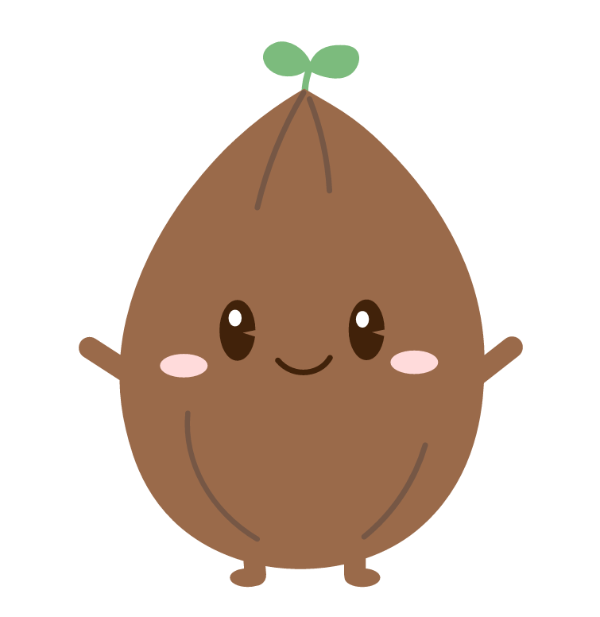
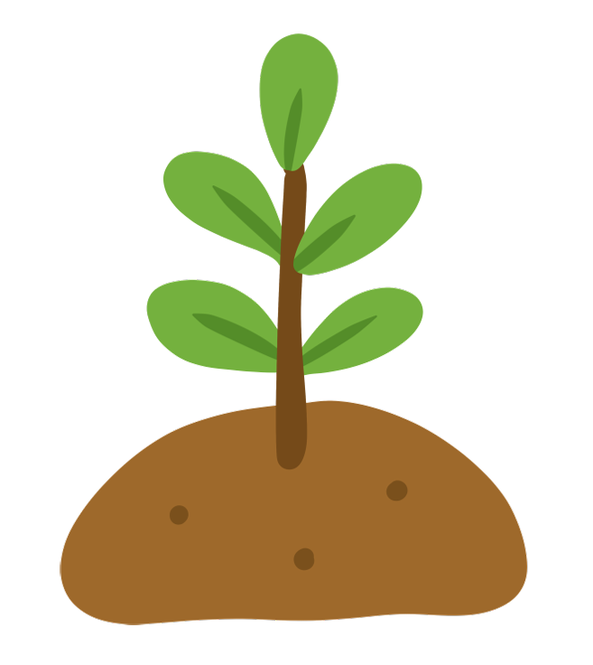
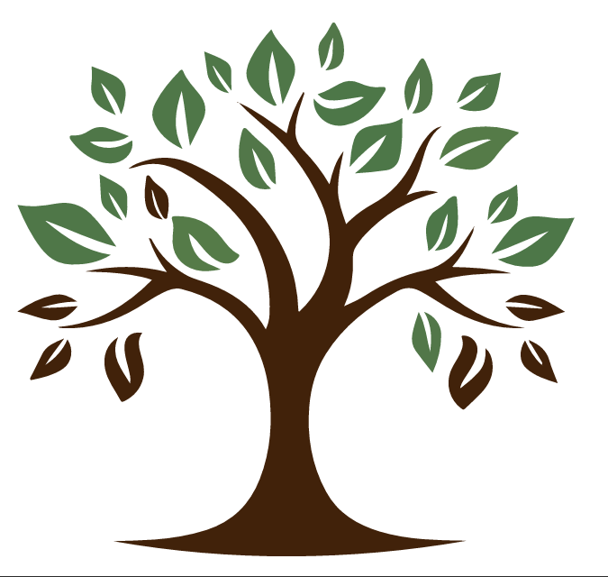
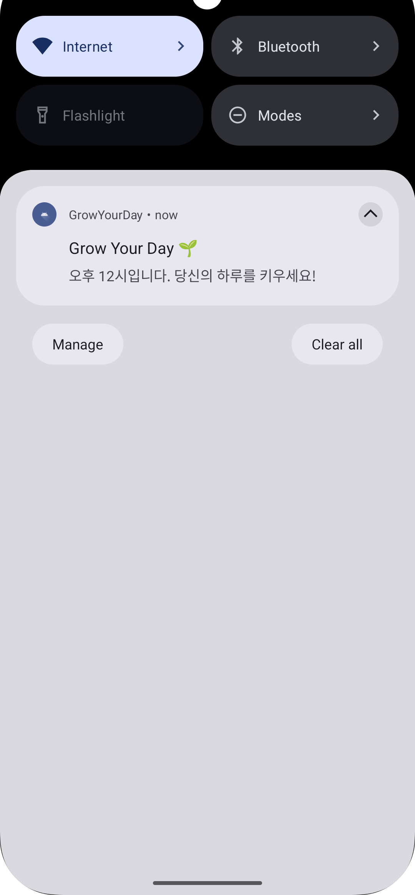

# 🌱GrowYourDay

GrowYourDay는 사용자가 하루 할 일을 관리하고 달성률을 시각적으로 확인할 수 있는 간단한 목표 관리 앱입니다.  
할 일을 완료할수록 나무가 자라나는 방식으로 진행률을 표현해, 사용자가 성취감을 느끼고 꾸준히 동기를 유지하도록 돕는 것이 특징입니다.  
또한 정해진 시간에 자동으로 알림을 보내 일정 관리에 도움을 주며, 사용자가 앱을 열지 않아도 해야 할 일을 잊지 않도록 안내합니다.

##  주요 화면

**할 일 추가 화면**  

  
  

**성장 나무 이미지 구성**   

  
  
  
  
  

**알림 화면** 

  

 

##  주요 기능

**할 일 추가**: 하단 입력 필드와 버튼을 통해 새로운 할 일을 목록에 추가할 수 있습니다.  
**할 일 완료/취소**: 각 할 일 항목의 체크박스를 통해 완료 상태를 변경할 수 있습니다.  
**할 일 삭제**: 휴지통 버튼을 눌러 할 일을 삭제할 수 있습니다.  
**실시간 진행률 표시**: 전체 할 일 대비 완료된 할 일의 비율을 계산하여 상단의 나무 아이콘과 퍼센트, 프로그레스 바로 시각화합니다.  
**데이터 영속성**: `Room` 데이터베이스를 사용하여 앱을 종료했다가 다시 켜도 할 일 목록이 그대로 유지됩니다.  
**할 일 알림**: 매일 12에 알림을 보내 할 일을 제때 수행할 수 있도록 도와줍니다.

##  앱 구조 및 설계 방식

**앱 구성 방식**

UI 구성 요소 설계: Scaffold, LazyColumn 등 Compose 기반 구성 요소들을 활용했습니다.

화면 렌더링 구조: Card, Button 등의 Composable로 사용자 인터페이스를 모듈화했습니다.

**앱 동작 원리·흐름**

상태 기반 UI 구조: LiveData/Flow를 통해 할 일 목록과 진행 상태를 실시간으로 UI와 연동되도록 구현했습니다.

사용자 상호작용 처리: 체크박스, 버튼 클릭 등 사용자 행동에 따라 ViewModel이 데이터를 갱신하고 UI가 자동으로 반영되도록 구성했습니다.

**전체 설계 설명**

앱 구조 설계: MVVM 패턴을 적용하여 UI와 내부 로직을 분리하고 유지보수와 확장성을 고려한 구조로 제작했습니다.

